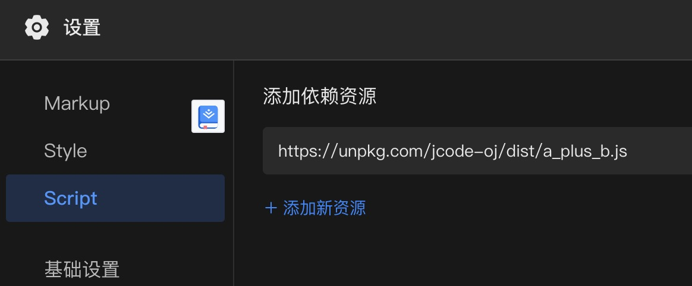

# JCODE-OJ

这是[码上掘金](code.juejin.cn)用来维护习题集的代码仓库。

习题保存在 `src` 目录下，分为描述题目的 Markdown 文档和判题的 JS 文件。

因为这是纯前端的判题，所以不能用于比赛，但可以用于练习和每日一题等活动。

## 使用方法

添加的题目发布时，会被编译到 dist 目录下对应的 JS 文件，只需要在码上掘金中添加对应的 JS 文件，比如

```
https://unpkg.com/jcode-oj/dist/a_plus_b.js
```



然后在 HTML 中，通过

```html
  <oj-test></oj-test>
  <oj-desc></oj-desc>
```

可以将题目描述和运行后通过测试的结果显示出来。

例如：[这个例子](https://code.juejin.cn/pen/7100755648471629838)

## 贡献题目

参照 `src` 目录下已有例子来添加新的例子，提交 PR，我们合并到代码仓库中，然后发布新版本即可生效。